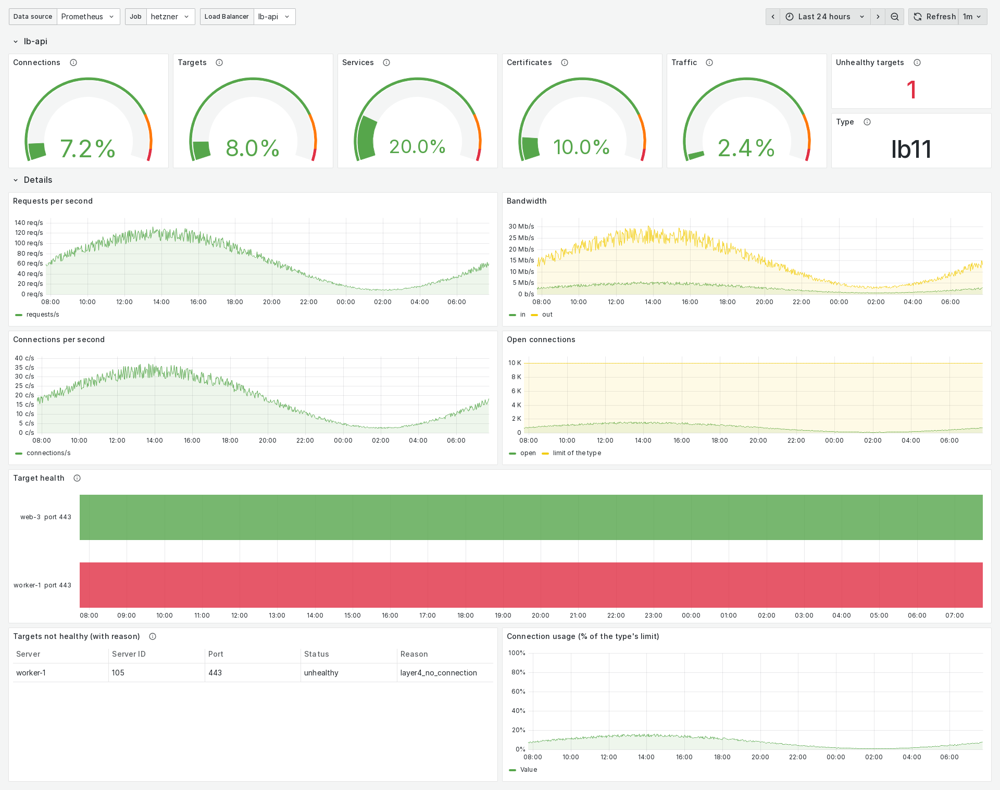
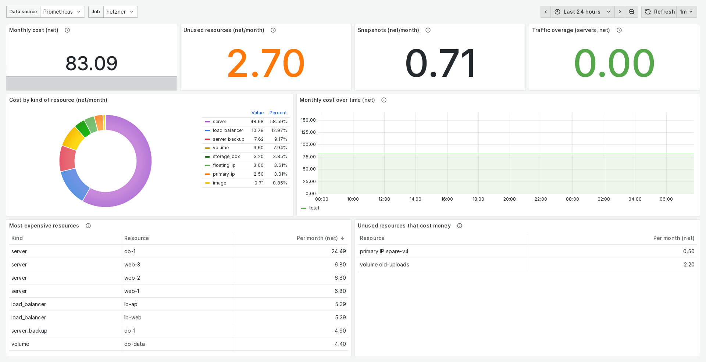
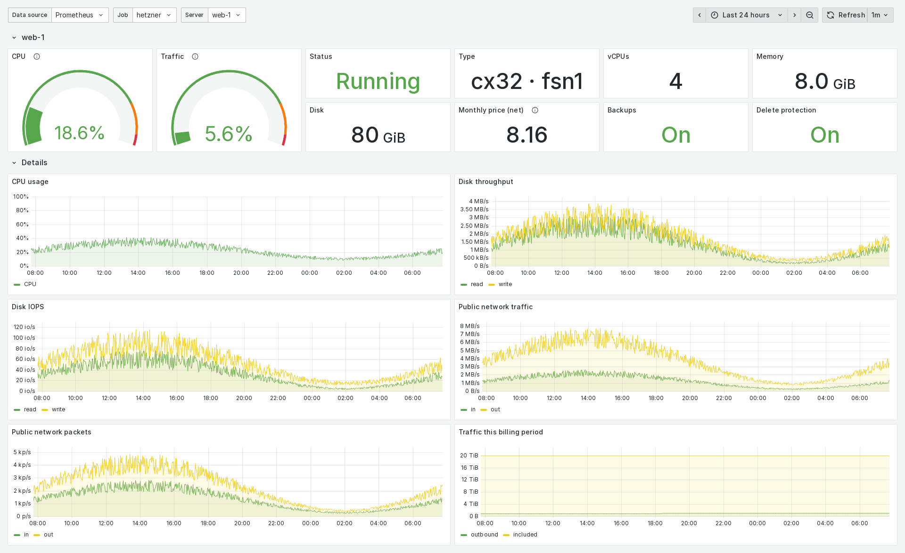
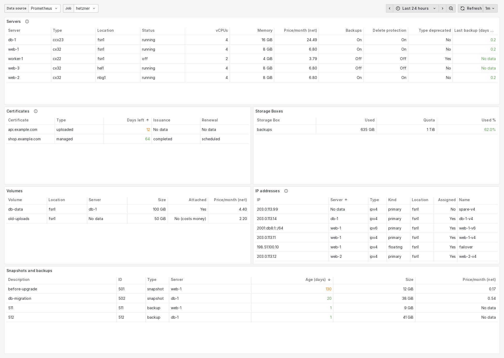
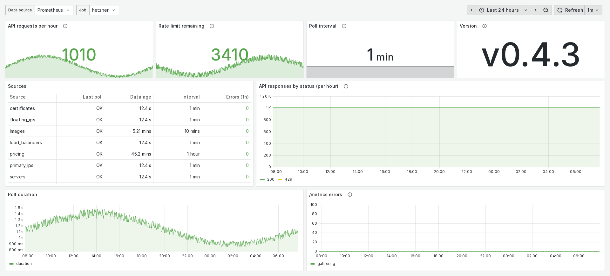

# Hetzner Cloud Prometheus Exporter

**Monitoring, costs and Grafana dashboards for your Hetzner Cloud project.**

[](https://github.com/smartecho-hr/hetzner_cloud_exporter/actions/workflows/ci.yml)
[](https://github.com/smartecho-hr/hetzner_cloud_exporter/releases/latest)
[](go.mod)
[](LICENSE)

Prometheus exporter for **Hetzner Cloud**: servers, Load Balancers, certificates, volumes, IPs,
snapshots, Storage Boxes, SSH keys and their costs. It polls the Hetzner Cloud API in the
background and stays within the API rate limit, however often Prometheus scrapes.



<sub>Screenshots show an invented demo project.</sub>

## Why this exporter?

Prometheus can already find Hetzner servers to scrape (`hetzner_sd_configs`), and node_exporter
measures what happens inside a server. Neither shows the Hetzner Cloud project itself: Load
Balancer target health and why a target is unhealthy, certificate expiry, the age of the newest
backup, traffic used vs. included, what every resource costs per month and which ones cost money
without being used. This exporter turns that into Prometheus metrics, with ready-made dashboards
and alerts.

It reads the Hetzner API on its own schedule, not on every scrape:

```
Hetzner API ──(background polls, default every 60s)──▶ exporter       keeps the latest values
                                                          ▲
                                                          │ scrapes, any interval
                                                          │
                                                     Prometheus ──▶ alerts (prometheus/alerts.yml)
                                                          │
                                                          ▼
                                                       Grafana        5 dashboards (grafana-dashboards/)
```

So scraping more often costs no API requests, slowly changing data (prices, SSH keys) is fetched
less often, and `hetzner_cloud_exporter_last_poll_success` and the included alerts show when
polling fails.

## Features

- **Servers:** CPU, disk throughput and IOPS, network bytes and packets, status, traffic used
  vs. included, size, backups (and the age of the newest one), protection, server type deprecation
- **Load Balancers:** open connections, connections and requests per second, bandwidth,
  target health per service **with the reason a target is unhealthy**, type limits vs. usage,
  services and health check settings, traffic
- **Certificates:** expiry timestamp, failed issuance or renewal
- **Volumes, floating and primary IPs, snapshots/backups, Storage Boxes, SSH keys**
- **Costs:** monthly price per resource (net), traffic overage price, unused resources that
  cost money. These are Hetzner's current list prices: resources ordered before a price change
  may be billed at their old, lower price, which the API doesn't report
- **Exporter health:** poll success per resource, API requests, remaining API rate limit
- **Background polling:** scrapes never call the Hetzner API; automatic backoff on HTTP 429
- Every collector can be turned off, and how often it is fetched can be set per collector
- TLS and basic auth via the standard Prometheus web config file
- Five Grafana dashboards (Load Balancers, servers, costs, inventory, exporter health) and 34
  Prometheus alerts, each with promtool unit tests
- Binaries for Linux, macOS and Windows (amd64, arm64) and a multi-arch Docker image

## Quick start

You need a **read-only API token** of the Hetzner Cloud project (Hetzner Console → project →
*Security → API tokens*). One exporter covers one project; for several projects, run several
exporters.

Get the exporter in one of these ways:

- **Binary:** download the archive for your platform (Linux, macOS, Windows; amd64 and arm64)
  from [Releases](https://github.com/smartecho-hr/hetzner_cloud_exporter/releases) and check it
  against `sha256sums.txt`.
- **Docker image:** `ghcr.io/smartecho-hr/hetzner-cloud-exporter` (amd64 and arm64), see
  [Docker](#docker).
- **Go:** `go install github.com/smartecho-hr/hetzner_cloud_exporter@latest`, or build the
  checkout. Any Go ≥ 1.21 downloads the required Go 1.27.1 by itself; some distributions set
  `GOTOOLCHAIN=local`, then prefix the command with `GOTOOLCHAIN=auto` or install Go 1.27.1.

```sh
CGO_ENABLED=0 go build -trimpath -o bin/hetzner_cloud_exporter .
HCLOUD_API_TOKEN=your-read-only-token ./bin/hetzner_cloud_exporter
curl -s localhost:9210/metrics | grep ^hetzner_cloud_
```

A wrong token shows up in the log as `Hetzner API rejected the token (401 unauthorized)`, and
`curl localhost:9210/ready` says why the exporter isn't ready.

Instead of the environment variable you can use a config file:
`cp config.example.yaml config.yaml`, set `api.token`, `chmod 600 config.yaml`, and run the
binary from that directory. Avoid `--hcloud.api-token` on the command line: other users on the
machine can see it in `ps`.

### Docker

The published image:

```sh
docker run -d -p 127.0.0.1:9210:9210 -e HCLOUD_API_TOKEN=your-read-only-token \
  ghcr.io/smartecho-hr/hetzner-cloud-exporter:latest
```

Use a version tag (e.g. `:v0.4.3`) instead of `:latest` to control upgrades. To build the image
yourself:

```sh
docker build -f docker/Dockerfile -t hetzner-cloud-exporter \
  --build-arg VERSION=$(git describe --tags --always) \
  --build-arg COMMIT=$(git rev-parse --short HEAD) \
  --build-arg BRANCH=$(git rev-parse --abbrev-ref HEAD) \
  --build-arg SOURCE_DATE_EPOCH=$(git log -1 --format=%ct) .
docker run -d -p 127.0.0.1:9210:9210 -e HCLOUD_API_TOKEN=your-read-only-token hetzner-cloud-exporter
```

The image runs as a non-root user (UID 65532) and has a `HEALTHCHECK` (`hetzner_cloud_exporter
healthcheck`: a TCP check of the listen address, found from the flags, `LISTEN_ADDRESS` or the
config file like the exporter does, so it also works with TLS and basic auth). Other ways to pass the
token: a Docker/Kubernetes secret file with `HCLOUD_API_TOKEN_FILE=/run/secrets/hcloud_token`,
or a config file mounted at `/app/config.yaml` (readable by UID 65532).

Without `--web.config.file` the metrics endpoint has no authentication, and Docker's port
publishing bypasses host firewalls like ufw: publish on `127.0.0.1` or use a Docker network
unless Prometheus scrapes from another host.

Docker Compose (builds the checkout, publishes on `127.0.0.1:9210`, read-only container without
capabilities; a commented example passes the token as a Docker secret):

```sh
cp docker/.env.example docker/.env   # set HCLOUD_API_TOKEN
chmod 600 docker/.env
cd docker && VERSION=$(git describe --tags --always) COMMIT=$(git rev-parse --short HEAD) \
  docker compose up -d --build
```

### Other platforms

Go cross-compiles without extra tools, e.g. for Windows or macOS on Apple silicon:

```sh
CGO_ENABLED=0 GOOS=windows GOARCH=amd64 go build -trimpath -o bin/hetzner_cloud_exporter.exe .
CGO_ENABLED=0 GOOS=darwin GOARCH=arm64 go build -trimpath -o bin/hetzner_cloud_exporter .
```

Multi-arch Docker image (amd64 + arm64; the Dockerfile cross-compiles, no emulation needed):

```sh
docker buildx build --platform linux/amd64,linux/arm64 -f docker/Dockerfile \
  --build-arg VERSION=$(git describe --tags --always) --build-arg COMMIT=$(git rev-parse --short HEAD) \
  --build-arg BRANCH=$(git rev-parse --abbrev-ref HEAD) --build-arg SOURCE_DATE_EPOCH=$(git log -1 --format=%ct) \
  -t you/hetzner-cloud-exporter:tag --push .
```

## Configuration

Every option can be set as a flag, an environment variable or in a YAML config file.
Precedence: **flag > environment variable > config file > default**; an empty value counts as
not set. Durations are written like `60s` or `2m`; a bare number means seconds. Unknown config keys and `COLLECTOR_*` variables are
logged as a warning, they never stop the exporter.

| Flag | Env | Config file key | Default | Description |
|---|---|---|---|---|
| `--hcloud.api-token` | `HCLOUD_API_TOKEN` | `api.token` | (required) | Hetzner Cloud API token |
| `--hcloud.api-token-file` | `HCLOUD_API_TOKEN_FILE` | `api.token_file` | | File with the token (e.g. a Docker/Kubernetes secret); token and token file are one option: the one from the higher layer wins, both in the same layer is an error |
| `--hcloud.poll-interval` | `POLL_INTERVAL` | `api.poll_interval` | `60s` | How often resources are listed (minimum `10s`) |
| `--hcloud.metrics-interval` | `METRICS_INTERVAL` | `api.metrics_interval` | `60s` | How often server and Load Balancer metrics are fetched (1 request per resource); `0` = off |
| `--hcloud.concurrency` | `CONCURRENCY` | `api.concurrency` | `5` | Maximum parallel API requests (1–50) |
| `--web.listen-address` | `LISTEN_ADDRESS` | `server.host` + `server.port` | `:9210` | HTTP listen address |
| `--web.metrics-path` | `METRICS_PATH` | `server.metrics_path` | `/metrics` | Path of the metrics endpoint |
| `--web.config.file` | `WEB_CONFIG_FILE` | `server.web_config_file` | | TLS and/or basic auth, see below |
| `--log.level` | `LOG_LEVEL` | `log.level` | `info` | `debug`, `info`, `warn`, `error` |
| `--collector.<name>` | `COLLECTOR_<NAME>` | `collectors.<name>` | `true` | Turn a collector on or off |
| `--collector.<name>.interval` | `COLLECTOR_<NAME>_INTERVAL` | `collector_intervals.<name>` | per collector | How often a collector is fetched; `0` = every poll, otherwise at least `10s` |
| `--config.file` | `CONFIG_FILE` | | `config.yaml` | Config file. The default `config.yaml` in the working directory is read if it exists; a file set explicitly must exist |
| `--version` | | | | Print version information and exit |

See [config.example.yaml](config.example.yaml) and [docker/.env.example](docker/.env.example)
for every option.

### Collectors

Each kind of Hetzner resource is a collector. A disabled collector makes no API requests.

| Collector | Default interval | What |
|---|---|---|
| `pricing` | 1h | Price list, for the `*_monthly_price` metrics |
| `servers` | every poll | Status, size, prices, traffic, backups; CPU/disk/network metrics every metrics interval |
| `load_balancers` | every poll | Metrics, type limits, services, target health, prices |
| `certificates` | every poll | Expiry, issuance/renewal status |
| `volumes` | every poll | Size, attachment, prices |
| `floating_ips` | every poll | Assignment, prices |
| `primary_ips` | every poll | Assignment, prices |
| `images` | 10m | Snapshots and backups: size, age, prices; last backup per server |
| `storage_boxes` | 5m | Quota, usage, access, prices |
| `ssh_keys` | 1h | Inventory |

```sh
./bin/hetzner_cloud_exporter --collector.certificates=false --collector.images.interval=30m
COLLECTOR_CERTIFICATES=false COLLECTOR_IMAGES_INTERVAL=30m ./bin/hetzner_cloud_exporter
```

```yaml
collectors:
  certificates: false
collector_intervals:
  images: 30m
```

In flags, `_` in a collector name becomes `-` (`--collector.load-balancers`). A longer interval
saves API requests; Prometheus still gets every metric on every scrape (the last fetched
values). Load Balancer targets are labelled with server names only while `servers` is on.

### TLS and basic auth

The exporter uses the standard Prometheus
[web configuration file](https://prometheus.io/docs/prometheus/latest/configuration/https/):

```yaml
# web.yml
tls_server_config:
  cert_file: /etc/hetzner_cloud_exporter/cert.pem
  key_file: /etc/hetzner_cloud_exporter/key.pem
basic_auth_users:
  prometheus: $2y$10$...   # bcrypt hash: htpasswd -nbBC 10 "" 'your-password' | tr -d ':\n'
```

```sh
./bin/hetzner_cloud_exporter --web.config.file=web.yml
```

Use TLS together with basic auth, otherwise the password travels in clear text. Basic auth
covers all endpoints, including `/healthz` and `/ready`.

## Endpoints

| Path | Description |
|---|---|
| `/metrics` | Prometheus metrics |
| `/healthz` | Liveness: `ok` while the HTTP server runs |
| `/ready` | `200` once every enabled collector has been fetched at least once, `503` with the missing ones before |
| `/version` | Build information as JSON (`name`, `version`, `branch`, `commit`, `build_user`, `build_date`, `go_version`, `platform`) |

## API rate limit

The Hetzner Cloud API allows **3600 requests per hour per project**, shared with every other
tool using the project (Terraform, CI, the Console). The exporter never calls the API on a
scrape; it polls in the background:

```
requests/hour ≈ list pages                × 3600 / poll interval
              + (running servers + LBs)   × 3600 / metrics interval
              + about 20 for prices, snapshots and SSH keys
```

Storage Boxes use a different API (`api.hetzner.com`) with its own budget and don't count here.

A list page holds 50 resources, so most projects need 6 per poll. Examples at the default 60s
intervals: 5 servers and 4 Load Balancers ≈ 900 requests/hour; 30 servers and 11 Load
Balancers ≈ 2820. With more resources, raise `--hcloud.metrics-interval` (a 2m interval loses
little, Hetzner's resolution is 60s) or set it to `0`.

The exporter reports its own Cloud API usage in `hetzner_cloud_exporter_api_requests_per_hour_estimate` and the
remaining budget in `hetzner_cloud_exporter_api_rate_limit_remaining`. On HTTP 429 from the Cloud API it
backs off by itself, up to 16 times the poll interval; a 429 from the Storage Box API only skips the
Storage Boxes until the next poll.

## Metrics

All metrics start with `hetzner_cloud_`, for example:

| Metric | Description |
|---|---|
| `hetzner_cloud_server_info` | One series per server: status, type, location |
| `hetzner_cloud_server_cpu_usage_ratio` | CPU usage across all vCPUs (0–1) |
| `hetzner_cloud_server_last_backup_timestamp_seconds` | Creation time of the newest backup |
| `hetzner_cloud_load_balancer_target_healthy` | Target health per service port (`target_health_status` adds the reason) |
| `hetzner_cloud_load_balancer_open_connections` | Open connections |
| `hetzner_cloud_certificate_not_valid_after_timestamp_seconds` | Certificate expiry |
| `hetzner_cloud_*_monthly_price` | Monthly price per resource |
| `hetzner_cloud_exporter_last_poll_success` | 1 if the last poll of a collector succeeded |

`curl -s localhost:9210/metrics | grep '^# HELP hetzner_cloud_'` lists every metric with its
description. Metrics come from the latest background poll; Hetzner reports rates (bytes/s,
requests/s) with a 60s resolution as gauges, so don't apply `rate()` to them.

Prices are net (without VAT) in the account's currency (`currency` label, from Hetzner's price
list). With the `pricing` collector off, server, Load Balancer and Storage Box prices are
assumed to be in EUR.

The exporter also exposes the standard `go_*` and `process_*` metrics.

To drop metrics you don't need, use `metric_relabel_configs` in Prometheus, or turn off the
whole collector.

## Prometheus

```yaml
scrape_configs:
  - job_name: hetzner
    scrape_interval: 60s
    static_configs:
      - targets: ['exporter-host:9210']
```

With TLS and basic auth enabled (`--web.config.file`):

```yaml
  - job_name: hetzner
    scrape_interval: 60s
    scheme: https
    tls_config:
      ca_file: /etc/prometheus/exporter-ca.crt   # or insecure_skip_verify: true for self-signed tests
    basic_auth:
      username: prometheus
      password_file: /etc/prometheus/hetzner-exporter.password
    static_configs:
      - targets: ['exporter-host:9210']
```

**Alerts:** `prometheus/alerts.yml` has 34 alerts for the exporter, servers, Load Balancers,
certificates, IPs and costs, plus the recording rule `job:hetzner_cloud_monthly_cost:sum`. Add it under
`rule_files`; `prometheus/alerts_test.yml` holds unit tests (`cd prometheus && promtool test rules alerts_test.yml`).

If the exporter's address changes (e.g. a scheduler with dynamic ports), Prometheus creates new
series with a new `instance` label. The included dashboards and alerts aggregate this label
away; for your own queries do the same (`max by (job, load_balancer) (...)`) or set a fixed
`instance` with `relabel_configs`.

## Grafana

Import the dashboards from `grafana-dashboards/` (*Dashboards → New → Import*); the release
archives contain them too, with `prometheus/alerts.yml`. Each dashboard has a *Data source* and
a *Job* selector (the Prometheus job of the exporter, so several exporters, e.g. one per Hetzner
project, never mix).

| File | What |
|---|---|
| `grafana_loadbalancer_dashboard.json` | One Load Balancer: limits, traffic, requests, target health with the reason |
| `grafana_servers_dashboard.json` | One server: CPU, disk, network, traffic, status, backups |
| `grafana_costs_dashboard.json` | Monthly cost, cost by resource, unused resources that cost money |
| `grafana_inventory_dashboard.json` | Tables of servers, certificates, Storage Boxes, volumes, IPs, snapshots |
| `grafana_exporter_dashboard.json` | Exporter health: polls, API requests, rate limit |

| Costs | Servers |
|---|---|
|  |  |
| **Inventory** | **Exporter health** |
|  |  |

## Development

```sh
go vet ./...
go test ./... -race -cover
# configured in .golangci.yml; built with the project's Go (a prebuilt one may refuse it)
go run github.com/golangci/golangci-lint/v2/cmd/golangci-lint@v2.14.0 run ./...
docker run --rm -v "$PWD/prometheus:/rules:ro" -w /rules --entrypoint promtool \
  prom/prometheus:v3.15.0 test rules alerts_test.yml
docker run --rm -v "$PWD/grafana-dashboards/test:/rules:ro" -w /rules --entrypoint promtool \
  prom/prometheus:v3.15.0 test rules dashboards_test.yml   # every dashboard query, see CONTRIBUTING.md
```

## Security

Use a **read-only** API token: the exporter never writes. Report security problems privately as
described in [SECURITY.md](SECURITY.md), not in a public issue.

## License

Apache License 2.0, © 2025-2026 SmartEcho d.o.o., see [LICENSE](LICENSE) and [NOTICE](NOTICE).
Bugs and questions: [GitHub Issues](https://github.com/smartecho-hr/hetzner_cloud_exporter/issues).
